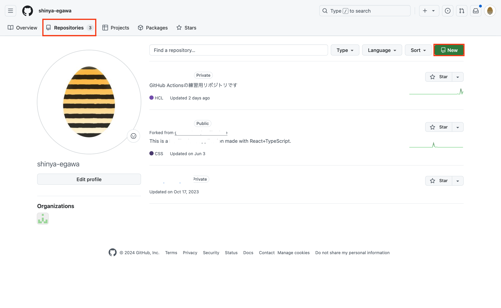
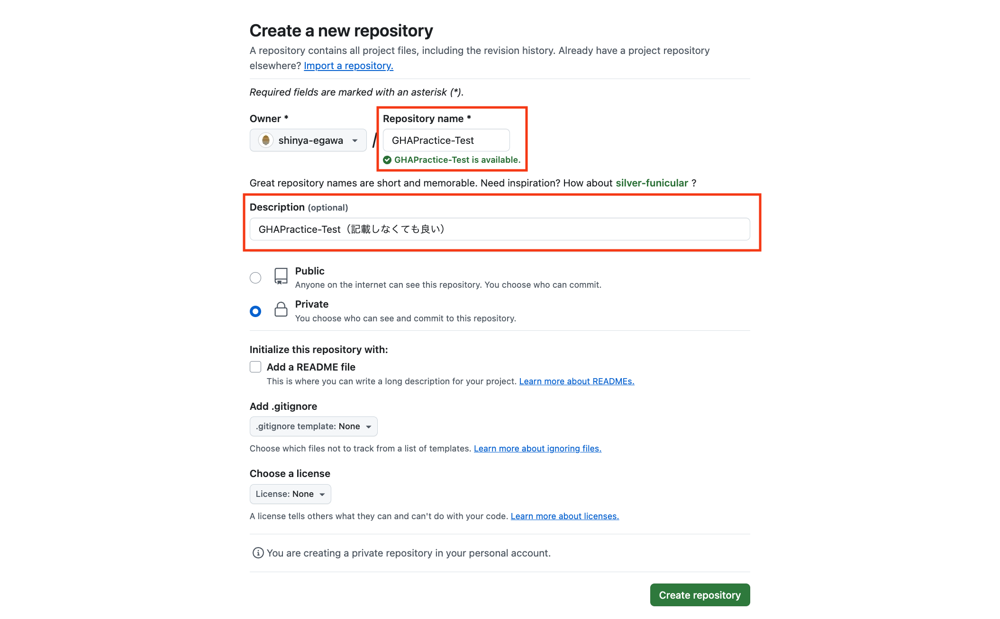
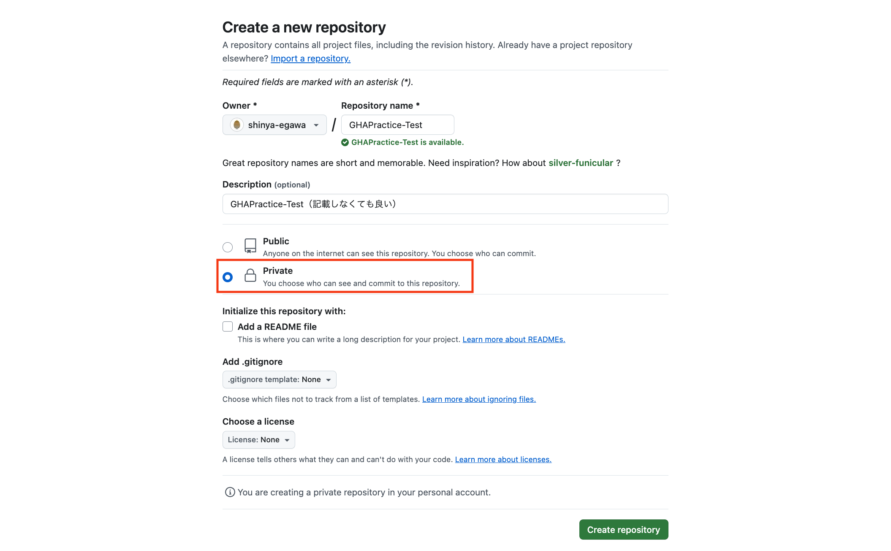
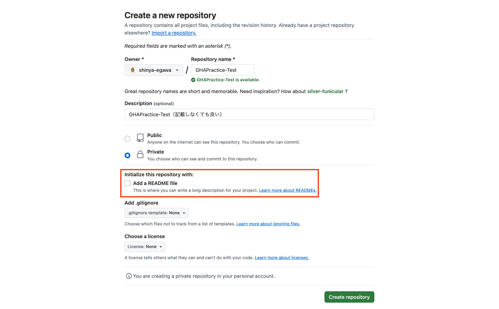
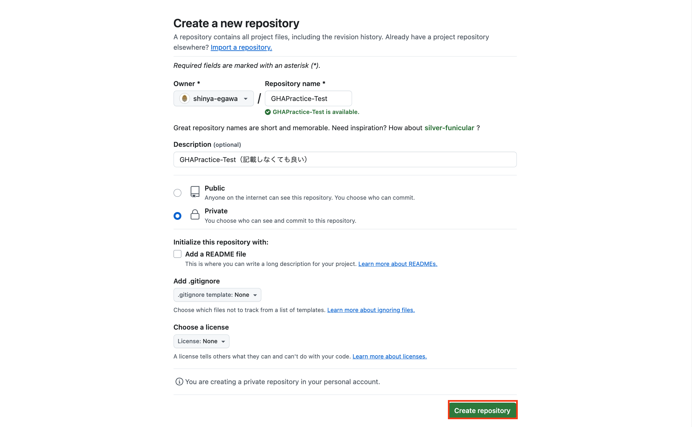

# GHAPractice

GitHub Actionsの練習用リポジトリです

## ディレクトリ構成
```
|-- .github
|   |-- workflows
|   |   |-- sample
|   |   |   |-- gha-practice-orgin.yml
|   |   |-- gha-practice.yml
|-- docs
|   |-- images
|   |-- ProduceManual.md
|-- terraform
|   |-- backend.tf
|   |-- local.tf
|   |-- s3.tf
|-- README.md
|-- .gitignore
```

基本触っていただくのは `.github` 内のみですが、S3バケットに付与する名称やタグを変更する必要がある為、ほんのちょびっとだけ `terraform` も触っていただく必要があります。

## Terraformにて触っていただく箇所

#### terraform/local.tf

以下の通りになっているので、自身の名前を記載してください。
但し、**S3バケットの名称に大文字を記載することができないので、全て小文字で記載していただく**様お願いいたします。
```
# Before
locals {
  bucket_name = "あなたの名前を記載してください"
  owner       = "あなたの名前を記載してください"
}

# After
locals {
  bucket_name = "sampletaro"
  owner       = "sampletaro"
}
```

## .github内について

基本は `.github/workflows` に存在します `gha-practice.yml` へ0から記載してください。
そうする事により、GHAの書き方を習得できるかと思います。

ですが、ハンズオン中に間に合わなくなったり、今後使っていきたい等がありましたら、sampleフォルダに完成品のワークフロー（`gha-practice-origin.yml`）がありますので、そちらをコピーしたり、workflowフォルダに移動させて使用してください。

## 手順書について

今回コードを書くほかにGitHubのsecretsへ登録する等複数の作業が存在します。

CI/CD実践の際には説明を行いながら作業を進めますが、手順書があると便利だと思い、[ProduceManual.md](/docs/ProcedureManual.md)に画像を添付しつつ手順を記載しています。作業の際は、こちらを参考にすることをお勧めします。

## Tips: GitHubへ初回プッシュをしたい人へ
今回、（パブリックに公開しても問題ない構成にはしているのですが）安全に安全を重ねたい為、資料やコードはローカルからのDLとさせていただいております。

その為、まずはローカルで保存したコードをGitHubにアップロードする必要があるため、その手順をこちらに記載します。

大まかな手順として

- まず、GitHub上でリポジトリを作成し
- ローカルリポジトリを初期化
- リモートリポジトリと連携 

となっております。

### GitHubで新しいリポジトリを作成する

1. GitHubにログインし、**Repositories**タブ > **Newボタン**をクリックします。


2. Repository nameを入力し、必要に応じて説明を追加します。


3. 今回パブリックにする必要はないので「**Private**」を選択します。


4. README fileは作成しているのでチェックは不要です。


5. 「**Create repository**」ボタンをクリックしてリポジトリを作成します。


### ローカルリポジトリを初期化し、リモートリポジトリと連携する

1. ターミナル（コマンドプロンプト）を開き、ローカルのプロジェクトディレクトリに移動します。

2. 以下のコマンドを実行してGitを初期化します。
```
git init
```

3. すべてのファイルをステージングエリアに追加します。
```
git add .
```

4. 最初のコミットを作成します。
```
git commit -m "Initial commit"
```

5. リモートリポジトリを「origin」という名前で追加します。以下のコマンドで、<リポジトリURL>を先ほど作成したGitHubリポジトリのURLに置き換えてください
```
git remote add origin <先ほど作成したリポジトリURL(https://github.com/自分の名前/リポジトリ名.git)>
```

6. ローカルの変更をリモートリポジトリにプッシュします。
```
git push -u origin main
```

7. 以上