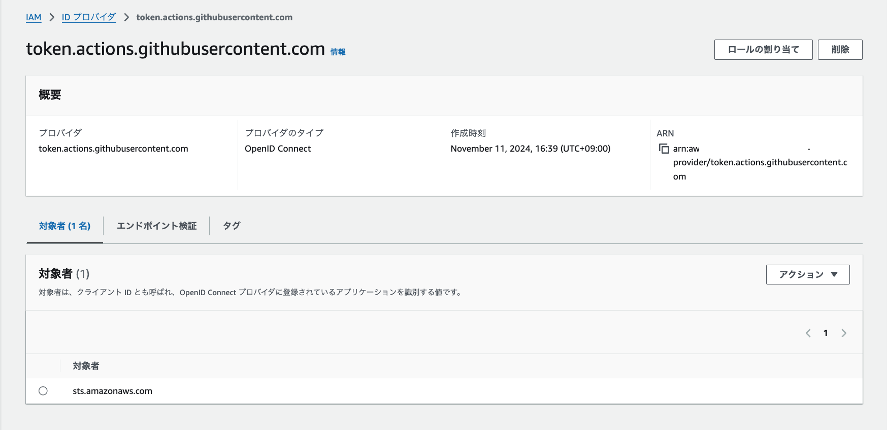
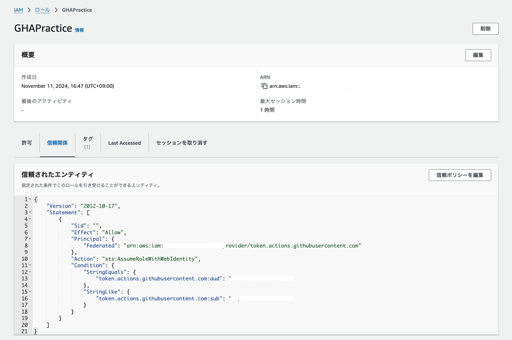
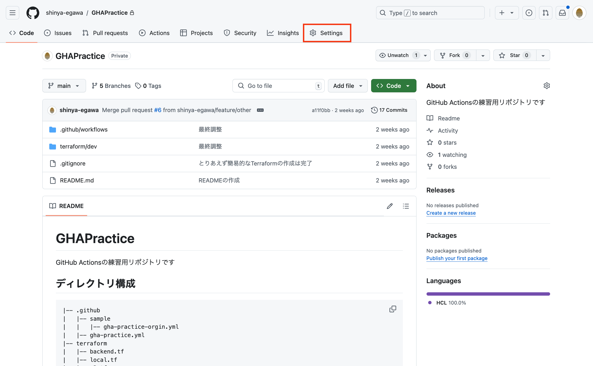
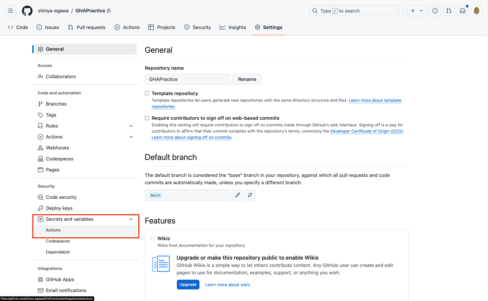
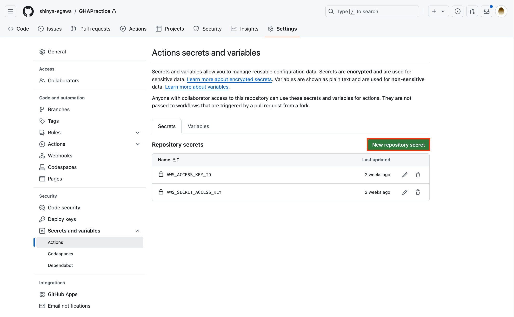
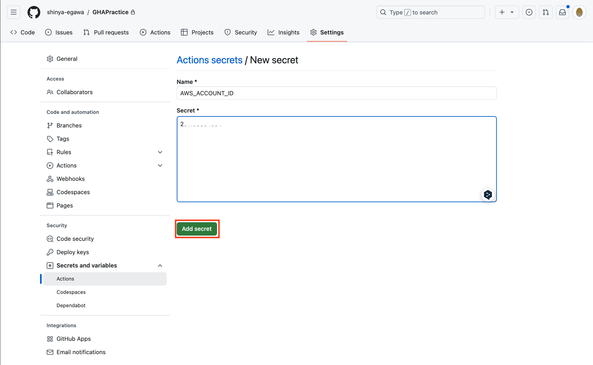
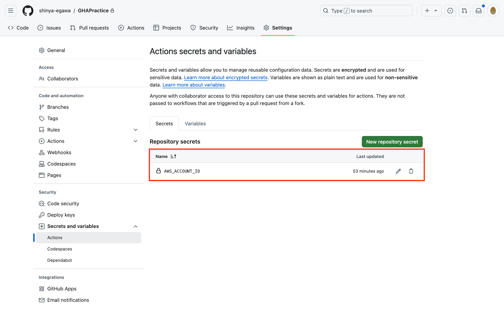
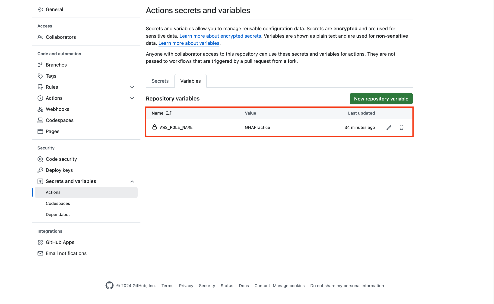

# ProduceManual

今回作業する手順書をこちらに記載しています

## 手順
### GitHub Secretsへの登録
1. （今回は作業なし）OIDCとIAMロールの作成を行います。



2. GitHub SecretsへAWSアカウントとロール名を登録します。GHAPracticeリポジトリへ移動し、**Settingsタブ**をクリックします。


3. 左ペインから **Secrets and variables** を選択 > **Actions**をクリックします。


4. **New repository secret**をクリックし新規作成を行います。


5. AWSアカウント（**AWS_ACCOUNT_ID**）を入力後、**Add secret**をクリックします。


6. AWSアカウント（**AWS_ACCOUNT_ID**）が作成されていることを確認してください。


7. 同様に、**Variables**の方へロール名（**AWS_ROLE_NAME**）の作成を行なってください。


8. 今回作成したシークレットと変数はそれぞれ以下のように使用します。
- AWSアカウント：**${{ secrets.AWS_ACCOUNT_ID }}**
- ロール名：**${{ vars.AWS_ROLE_NAME }}**

### Terraformの修正

今回の実践ではTerraformを使用したAWSへのリソースデプロイを行います。

極力、Terraformを知らない方にも使えるようにはしてあるのですが、リソースの名称とタグに作業者の名前を入れたかった為、そこだけ記載をお願いします。
Terraformの公式サイトは[こちらから](https://www.terraform.io/)

```
!-!-!-!-!-! コードをいじる前のチェック !-!-!-!-!-!

GitHub Actionsが稼働する条件（トリガー）として、「mainブランチへのpush」と「pull request」を今回対象としています。

その為、必ずブランチを切り、コードを作成・編集し、PRを投げて、mainブランチへマージするという手順を取っていただきますようよろしくお願いいたします。
```

#### terraform/dev/local.tfの編集

ブランチが切られており、mainブランチ以外のブランチにいることを確認してください。

その後、[terraform/dev/local.tf](../terraform/dev/local.tf)を編集します。以下の通りになっているので、自身の名前を記載してください。
但し、**S3バケットの名称に大文字を記載することができないので、全て小文字で記載していただく**様お願いいたします。
```
# Before
locals {
  bucket_name = "あなたの名前を記載してください"
  owner       = "あなたの名前を記載してください"
}

# After
locals {
  bucket_name = "sampletaro"
  owner       = "sampletaro"
}
```

### ワークフローの作成

今回2種類のワークフローを用意してあります。
また、GitHub Actionsの特性上、`.github/workflows/` 直下にワークフローファイルを作成する必要がありますのでご注意ください。
- [gha-practice.yml](../.github/workflows/gha-practice.yml)
  - 特に何も記載がされていないワークフローです。今回はこちらにGitHub Actionsのワークフローを記載してもらい、実際に動くところを確認していきます。
  - `.github/workflows/` 直下に存在するファイルなのでPRやマージしたタイミングで稼働します。
- [gha-practice-origin.yml](../.github/workflows/sample/gha-practice-origin.yml)
  - すでに今回作成する内容が記載されているワークフローです。ハンズオン中に間に合わなくなったり、見比べながら作業を行いたい場合、こちらのワークフローを参考にしながら記載を行なってください。
  - `.github/workflows/` 直下に存在しないファイルなのでPRやマージを行なっても稼働しません。